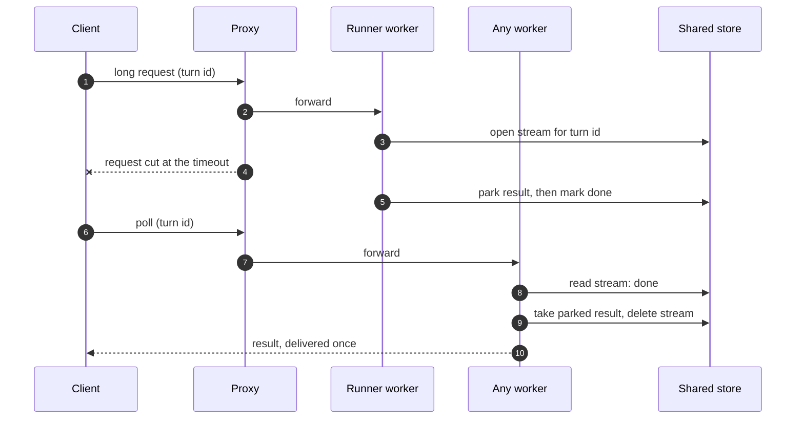

# Durable Delivery Across a Cut Request

## Intent

A long request and the work behind it have different lifetimes. A proxy, a load
balancer or a worker recycle can cut the request at 60 seconds while the work runs on
for minutes and then has nowhere to send its result. The user sees a spinner forever,
and nothing errors. The forces: the result must reach the client exactly once, from
whichever worker the client's next request happens to reach; the client must learn
quickly when the work truly died; and anything parked for delivery is a copy of the
result at rest, so it must not outlive its purpose.

## Structure

Participants: the **client** (holds a turn id derived from the request, plus whether it
already has the answer), the **runner** (the worker doing the work), **any worker**
(serves polls), and a **shared store** all workers can read and write.

1. The client sends the long request and starts polling on the side.
2. The runner opens a stream record for the turn id and publishes progress to it.
3. On completion the runner **parks** the result in the store, then marks the stream
   done, in that order, so a poll that sees "done" can always find the result.
4. **If the long request survives**, the result rides back on it, and the client replaces
   its turn id with an acknowledgement. A handler on that change deletes the parked
   result and the stream.
5. **If the request was cut**, the next poll finds "done", takes the parked result,
   deletes the copies, and delivers it. The turn id is the deduplication key, so the
   answer appears once whichever path delivers it.
6. **If the runner died**, the poll asks whether the runner process still exists (same
   host only) and reports the turn lost at once; a silence timeout is the backstop.

In CAP terms the cut request is a partition between client and server. The pattern
stays **available** through it (a second channel delivers) and **consistent** where the
user can see it (one answer, keyed by turn id): the standard response to a partition you
expect to heal.

## House adaptation

- **Derive the turn id from the request payload** (a hash of question and timestamp), so
  the client, the runner and every poller compute the same id with no handoff and no race.
  Don't mint a random id in one process and pass it through the store.
- **Acknowledge into a separate sink.** The ack handler must not write back to the
  client's turn-id field: an ack that lands after the next question started would clear
  the new turn's id and switch its poll off.
- **Delete on delivery, then expire as a ceiling.** Delivery, by either path, deletes the
  parked result and the stream. TTLs are only for a client that went away: minutes for
  the parked result, and the stream should drop to the same TTL once the turn closes,
  because it carries the same prose.
- **Single-host lets you replace a guess with a fact.** Record the runner's pid and host
  in the stream; a poller on the same host checks `kill(pid, 0)` and reports a dead runner
  in about a second, against minutes for a silence timeout. Keep the timeout as the
  backstop: another host, no pid, or a reused pid all read as alive.
- **SQLite in WAL mode is a sound shared store on one host.** It ships with the runtime,
  is process-safe on one filesystem, and in WAL mode readers never wait for the writer,
  which matters when a runner republishes a few times a second and every open client polls
  every 0.4 to 2 s. Create the file 0600 before SQLite opens it (the -wal and -shm files
  inherit its mode), turn on `secure_delete`, and keep it out of the shared tmpdir.
- **Checkpoint right after deleting.** WAL keeps old copies of deleted rows until a
  checkpoint resets the log. Run `PRAGMA wal_checkpoint(TRUNCATE)` at the end of the
  delete-on-delivery step, not on a sweep that only fires when something else writes.
- **Fail open, and say so.** If the store is unavailable, every call returns a neutral
  value and the request path behaves as it did before the pattern. Anything that leans on
  the store for a guarantee (a shared rate limit, say) must log loudly when it degrades.

## Reference instantiation

- **An LLM "ask your data" chat in a client analytics dashboard** (Dash, gunicorn with 4
  workers × 4 threads, nginx in front), 2026-09/10. nginx's 60 s `proxy_read_timeout` cut
  every chat request; turns finished about two minutes in and the page sat on "still
  working" for half an hour. With this pattern, on a prod replica at the incident's 60 s:
  every answer delivered (five by the poll), none duplicated, and a killed runner reported
  1.6 s after the kill against 329 s on the timeout alone. The review found the overnight
  WAL gap: after the day's last turn the -wal held 1.8 MB and 273 copies of one name from
  the answers, unchanged while idle, because the checkpoint ran only on the next write.

## Anti-patterns / when NOT

- **The proxy timeout is the bug.** If the work reliably finishes in a known time, raise
  the timeout first; this pattern is for work whose length you cannot bound, or a path you
  do not control.
- **Server push is available.** With WebSockets or Server-Sent Events, push the result.
  Polling is the fallback for when callbacks or long-lived connections are not possible.
- **More than one host.** The file-backed store and the pid check both assume one machine.
  Across hosts the store becomes a network service (Redis or a database), partitions
  between host and store become routine, and dead-runner detection falls back to timeouts.
  Design that deliberately; don't stretch this version.
- **Relying on SQLite's auto-checkpoint.** It fires only when the WAL reaches 1000 pages,
  about 4 MB. A quiet system never gets there, so deleted results sit in the log until
  traffic resumes.
- **Trusting truncation to erase.** Emptying or truncating a file frees the blocks without
  overwriting them, and `secure_delete` covers the main file only. If the disk is not
  encrypted at rest and the results are sensitive, keep the store on a RAM-backed
  filesystem (`/dev/shm`, in a 0700 directory) so nothing reaches the disk.
- **Unchecked reads by default.** An owner argument that defaults to "anyone" is an
  unchecked read waiting for a future caller to forget it. Make the owner required and
  give the unchecked case an explicit sentinel.

## Prior art

- **Asynchronous Request-Reply.** Microsoft Azure Architecture Center, cloud design
  patterns: <https://learn.microsoft.com/en-us/azure/architecture/patterns/asynchronous-request-reply>.
  Taken: decouple the work from the request and let the client poll a status resource.
  Departs: the original request is not answered with 202 at once. It stays open and
  delivers if it survives, and the poll is the fallback, so the common case keeps its
  single round trip and only a cut request pays for polling.
- **Idempotent Receiver.** Gregor Hohpe and Bobby Woolf, *Enterprise Integration
  Patterns* (2003): <https://www.enterpriseintegrationpatterns.com/patterns/messaging/IdempotentReceiver.html>.
  Taken: deduplicate on a message id so a second delivery is harmless. Departs: the
  receiver is the browser, and the dedup record is the turn-id field it already holds,
  with no separate seen-ids store.
- **Write-Ahead Log.** Unmesh Joshi, *Patterns of Distributed Systems* (2023):
  <https://martinfowler.com/articles/patterns-of-distributed-systems/write-ahead-log.html>;
  SQLite's implementation: <https://www.sqlite.org/wal.html>. Taken: SQLite's WAL mode as
  the concurrency mechanism for the shared store. Departs: the textbook WAL is about
  durability; here durability barely matters (the store only needs to live minutes), and
  the house rule is about the opposite, making deleted data actually leave.
- **CAP and PACELC.** Eric Brewer, "CAP Twelve Years Later: How the 'Rules' Have Changed",
  *IEEE Computer* 45(2), 2012; Daniel Abadi, "Consistency Tradeoffs in Modern Distributed
  Database System Design", *IEEE Computer* 45(2), 2012; Martin Kleppmann, *Designing
  Data-Intensive Applications* (2017), on consistency and on stream processing. Taken: the
  vocabulary for why the cut request is a partition and why the store's journal mode is a
  latency/consistency choice, not a CAP one.
